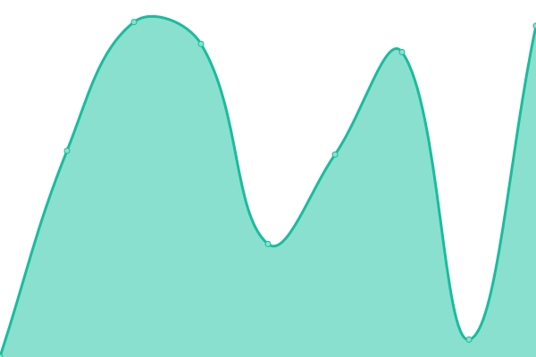
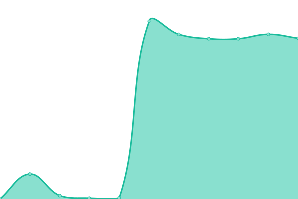
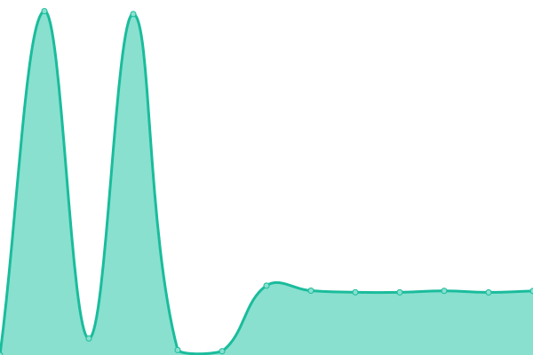
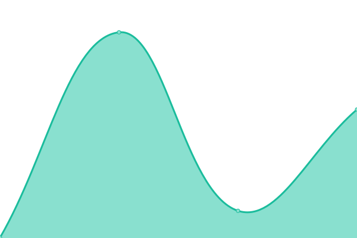
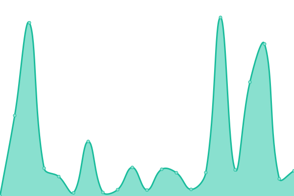
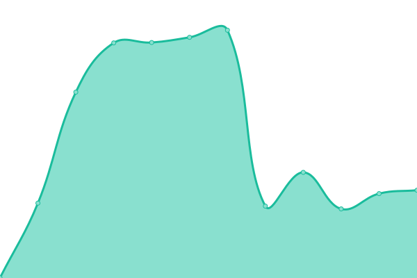
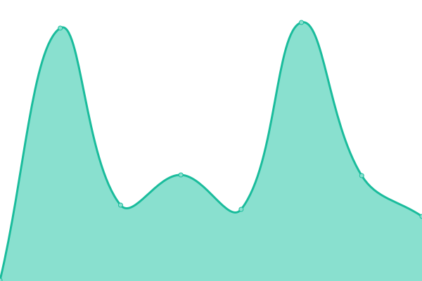

# [📈 Live Status](https://status.craftingcomrades.net): <!--live status--> **🟧 Partial outage**

This repository contains the open-source uptime monitor and status page for [RoblKyogre](https://roblkyogre.craftingcomrades.net), powered by [Upptime](https://github.com/upptime/upptime).

With [Upptime](https://upptime.js.org), you can get your own unlimited and free uptime monitor and status page, powered entirely by a GitHub repository. We use [Issues](https://github.com/RoblKyogre/uptime/issues) as incident reports, [Actions](https://github.com/RoblKyogre/uptime/actions) as uptime monitors, and [Pages](https://status.craftingcomrades.net) for the status page.

<!--start: status pages-->
<!-- This summary is generated by Upptime (https://github.com/upptime/upptime) -->
<!-- Do not edit this manually, your changes will be overwritten -->
<!-- prettier-ignore -->
| URL | Status | History | Response Time | Uptime |
| --- | ------ | ------- | ------------- | ------ |
|  [Main Website](https://craftingcomrades.net/) | 🟩 Up | [main-website.yml](https://github.com/RoblKyogre/uptime/commits/HEAD/history/main-website.yml) | 

 382ms
     
 | 

<a href="https://status.craftingcomrades.net/history/main-website">18.67%</a>
    

|  [SSH](craftingcomrades.net) | 🟩 Up | [ssh.yml](https://github.com/RoblKyogre/uptime/commits/HEAD/history/ssh.yml) | 

 93ms
     
 | 

<a href="https://status.craftingcomrades.net/history/ssh">19.10%</a>
    

|  [Pocketbase](https://db.craftingcomrades.net/api/health) | 🟩 Up | [pocketbase.yml](https://github.com/RoblKyogre/uptime/commits/HEAD/history/pocketbase.yml) | 

 6592ms
     
 | 

<a href="https://status.craftingcomrades.net/history/pocketbase">18.67%</a>
    

|  [Matrix (Frontend)](https://matrix.craftingcomrades.net/) | 🟩 Up | [matrix-frontend.yml](https://github.com/RoblKyogre/uptime/commits/HEAD/history/matrix-frontend.yml) | 

 1726ms
     
 | 

<a href="https://status.craftingcomrades.net/history/matrix-frontend">18.67%</a>
    

|  [Matrix (Backend)](https://matrix.craftingcomrades.net/_matrix/federation/v1/version) | 🟩 Up | [matrix-backend.yml](https://github.com/RoblKyogre/uptime/commits/HEAD/history/matrix-backend.yml) | 

 1619ms
     
 | 

<a href="https://status.craftingcomrades.net/history/matrix-backend">18.51%</a>
    

|  [Mastodon](https://mastodon.craftingcomrades.net/) | 🟥 Down | [mastodon.yml](https://github.com/RoblKyogre/uptime/commits/HEAD/history/mastodon.yml) | 

 1820ms
     
 | 

<a href="https://status.craftingcomrades.net/history/mastodon">18.51%</a>
    

|  [Vaultwarden](https://vault.craftingcomrades.net/) | 🟩 Up | [vaultwarden.yml](https://github.com/RoblKyogre/uptime/commits/HEAD/history/vaultwarden.yml) | 

 510ms
     
 | 

<a href="https://status.craftingcomrades.net/history/vaultwarden">100.00%</a>
    

|  [Gitea](https://git.craftingcomrades.net/) | 🟩 Up | [gitea.yml](https://github.com/RoblKyogre/uptime/commits/HEAD/history/gitea.yml) | 

 314ms
     
 | 

<a href="https://status.craftingcomrades.net/history/gitea">18.67%</a>
    

|  [Nextcloud](https://cloud.craftingcomrades.net/) | 🟩 Up | [nextcloud.yml](https://github.com/RoblKyogre/uptime/commits/HEAD/history/nextcloud.yml) | 

 8380ms
     
 | 

<a href="https://status.craftingcomrades.net/history/nextcloud">18.51%</a>
    

|  [Jellyfin](https://jellyfin.craftingcomrades.net/) | 🟩 Up | [jellyfin.yml](https://github.com/RoblKyogre/uptime/commits/HEAD/history/jellyfin.yml) | 

 1344ms
     
 | 

<a href="https://status.craftingcomrades.net/history/jellyfin">18.66%</a>
    

|  [VIAaaS](https://via.craftingcomrades.net/) | 🟩 Up | [vi-aaa-s.yml](https://github.com/RoblKyogre/uptime/commits/HEAD/history/vi-aaa-s.yml) | 

 912ms
     
 | 

<a href="https://status.craftingcomrades.net/history/vi-aaa-s">100.00%</a>
    

|  [Snappymail](https://mail.craftingcomrades.net/) | 🟩 Up | [snappymail.yml](https://github.com/RoblKyogre/uptime/commits/HEAD/history/snappymail.yml) | 

 770ms
     
 | 

<a href="https://status.craftingcomrades.net/history/snappymail">100.00%</a>
    

<!--end: status pages-->

[**Visit our status website →**](https://status.craftingcomrades.net)

## 📄 License

- Powered by: [Upptime](https://github.com/upptime/upptime)
- Code: [MIT](./LICENSE) © [RoblKyogre](https://roblkyogre.craftingcomrades.net)
- Data in the `./history` directory: [Open Database License](https://opendatacommons.org/licenses/odbl/1-0/)
